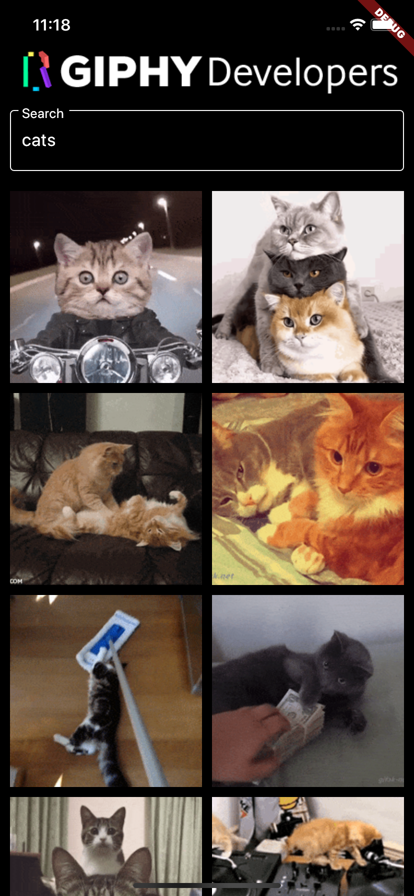
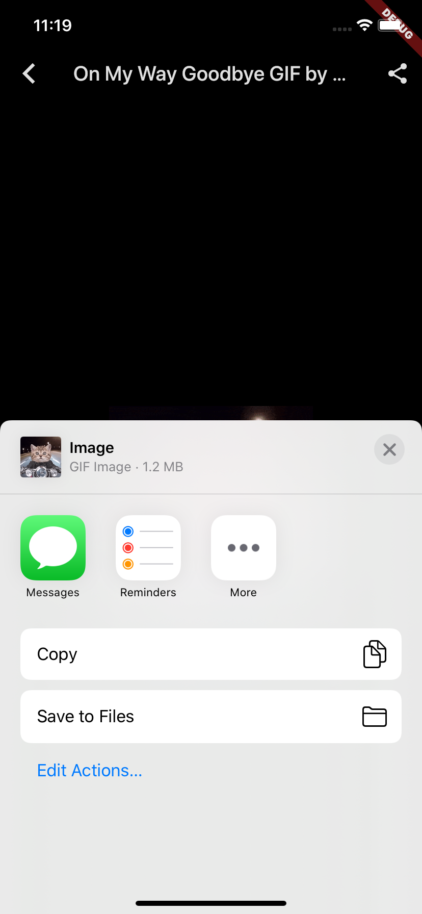
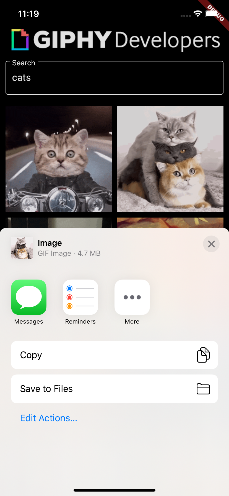

<h1 align="center">GIF App</h1>

<p align="center">
  
  
  
</p>
<p align="center">
  
  
</p>

## How to use

To clone and run this application, you'll need [Git](https://git-scm.com/downloads) and [Flutter](https://flutter.dev/docs/get-started/install) installed on your computer. From your command line:

```
# Clone this repository
$ git clone https://github.com/feMoraes0/gif-app.git

# Go into the repository
$ cd gif-app

# Install dependencies
$ flutter packages get

# Run the app
$ flutter run
```

## Credits
 - [Udemy course created by Daniel Ciolfi](https://www.udemy.com/course/curso-completo-flutter-app-android-ios/)

## Contact
  - <a target="_blank" href="https://www.linkedin.com/in/fernando-moraes-48a26916a/">LinkedIn</a>
  - <a target="_blank" href="mailto:fernandomoraes.lopes@gmail.com">E-mail</a>